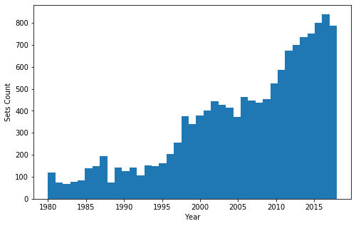
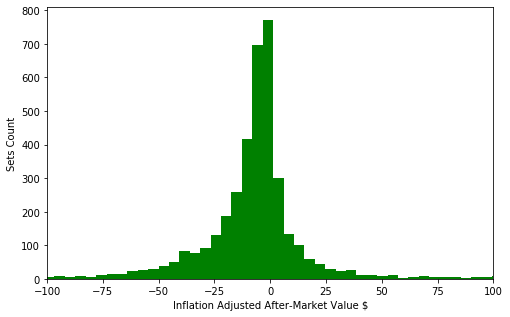
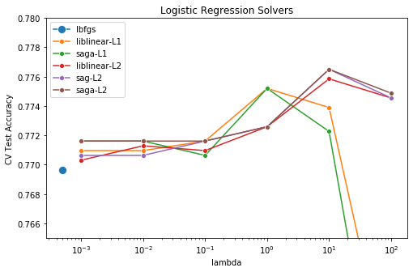
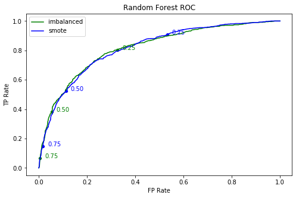

# Classification for Profitability of New LEGO Sets

The goal of this project is to predict whether a LEGO set will be profitable if bought in store and sold later in the online marketplace. We imagine that we have clients who are interested in long-term investment in LEGO sets, and want to provide them with the best recommendation for whether to buy or not a newly released set. Therefore our algorithm will classify new sets into 2 categories: profitable, and not profitable.

This project was created under the FlatIron School's Data Science Bootcamp, for the Module 5 project.

[Non-Technical Presentation (Google Slides)](https://docs.google.com/presentation/d/1p3eqReoSEz2ut75-WD99ZIlFgdN_etg459Ask3iq8E0/edit?usp=sharing)

## Project Roadmap

**Contributors:** Phillip Busko & Nathan Venos

**Data Sources**
- [brickset.com](https://brickset.com)
- [kaggle.com](https://www.kaggle.com/rtatman/lego-database)

**Tasks**
- Scrape and clean data from brickset website *(PB)*
- Join kaggle data and run feature engineering *(NV)*
- Run logistic regression for profitability class *(PB)*
- Run random forest for profitability class *(PB)*
- Run XGBoost for profitability class *(NV)*

## Results

Our most definitive results came from the XGBoost analysis. We found we could recommend a set to be bought with 71.3% accuracy, whereas we could recommend not to buy with 84.0% accuracy. 

## Methodology

**1. Scrape & Clean Data:** Data was scraped using the <i>requests</i> and <i>beautifulsoup</i> libraries. Since there are thousands of sets available, the work was broken down by first getting the url of each set for each year. Then each url is visited, and it's data is scraped. The data fields available from this are: set-id, name, year, themes, minifig count, store price, used price, user rating, and set type. Some filtering was done on the rows, so that LEGO non-sets, such as clothing items, are removed from the data. Also, any rows without store price data are eliminated. The next graph shows the release year distribution, just for exploratory data analysis.

**2. Feature Engineering:** The kaggle data was joined with the basic data for additional features. Some of these features are readily available, while others were manufactured based on informed guessing. The new data fields are: total number of pieces, number of different pieces, total number of pieces per piece category (1 column per category), primary color, secondary color, and number of different colors. The categorical features (color, themes) were aggregated into more coarse-grain values and then one-hot encoded. Finally, all the columns are standardized with <i>sklearn.preprocessing.StandardScaler</i> as part of the pipeline.

**3. Target Variable:** The target variable, which is whether a set is profitable or not, is not present in the data set, so we created it. First, the store price is adjusted for inflation. This was done with an approximation that each year has an inflation rate of 2.63%. Secondly, the aftermarket column is created. From that, the profitable column is derived as explained next.

> aftermarket = used_price - store_price  
> profitable: <b>1</b> if aftermarket > 0, <b>0</b> otherwise

The next graph shows the distribution of the aftermarket column. It shows that this column is biased towards the negative side, meaning most LEGO sets are not profitable. More specifically, 74% are not profitable. 

**4. Logistic Regression:** Logistic regression was run with a few different configurations involving different solvers and regularization types. Each configuration was run with a grid search to tune the regularization hyper-parameter <b>&#955;</b>. Each run was cross-validated with 5 folds. The next graph shows the CV test accuracy for each configuration. It shows that the best configuration is with the saga solver and L2 regularization with <b>&#955;</b> = 10.

**5. Random Forest:** First a single decision tree was run with 5-fold cross-validation. The training accuracy was quite high at 99.8%, but the test accuracy was much lower at 71.2%, which shows that some gross over-fitting is happening. The next step was running a vanilla random forest, which returned the same training accuracy, but 79.4% test accuracy. Though the test score was improved, the over-fitting problem remained. 

Next some experimenting was done with 3 different sampling techniques: imbalanced, undersampling and SMOTE. Since cross-validation was used for each configuration, the pipeline from the <i>imblearn</i> package was used. The sampling techniques did not significantly alter the results from the imbalanced results. The next graph shows an ROC curve for 2 different balances. The value indicated on the curves is the class-assignment threshold value.

Lastly, a grid search was used to tune some hyper-parameters such as <i>estimators</i> and <i>max_depth</i>. This only increased the test accuracy to 80.4%. 

**6. XGBoost:** XGBoost is not available in <i>sklearn</i> and was instead installed from the <i>xgboost</i> package. The baseline CV test accuracy was 80.0%. The first variation was using PCA to address the over-fitting problem and reduce the computational time of the grid search. However, both PCA and SMOTE slightly reduced the accuracy. Iterative feature inclusion was then used to find the optimal number of features based on the CV test results. We ultimately found that 71 of 92 features was the sweet spot, which yielded a CV test accuracy of 81.3%. 

